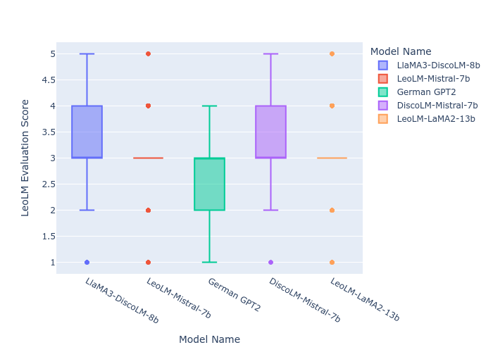
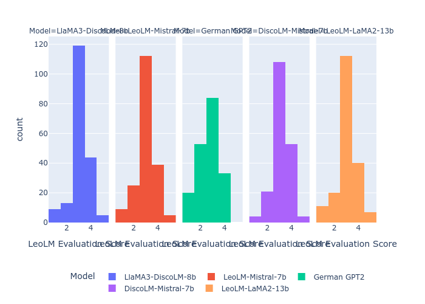
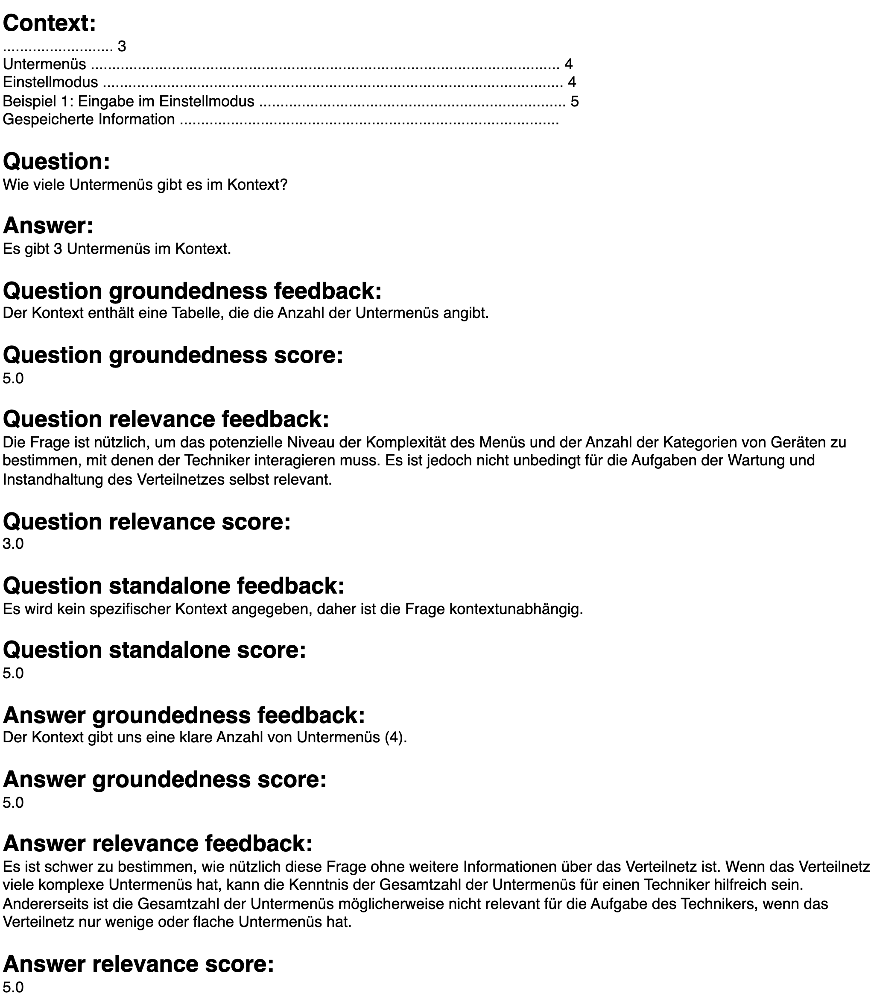
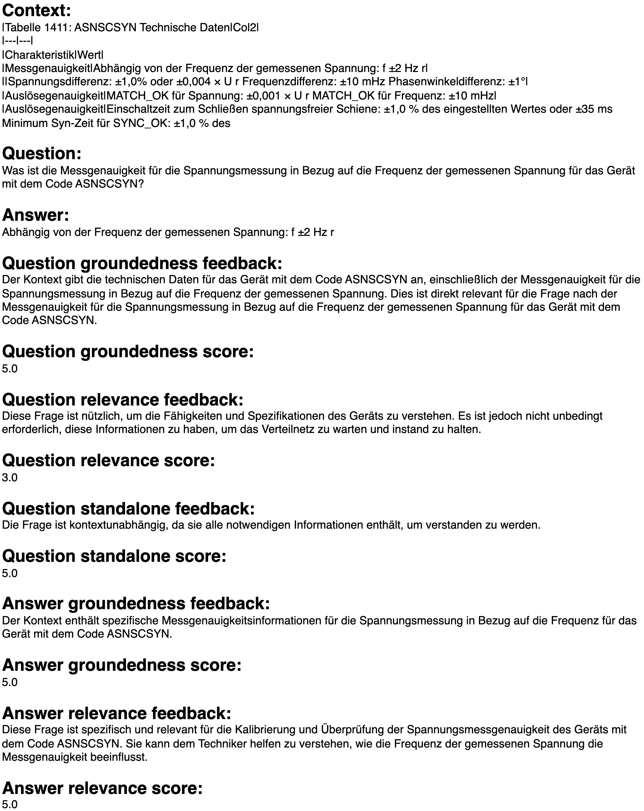

# Don't Touch the Power line
This work is a research-in-progress for developing an LLM-based assistance system to support the maintenance in the distribution grid.
We base our pipeline for the PoC is based on the related work, while we adapt the prompts from a RAG evaluation tutorial of [Roucher \[2024\]](https://huggingface.co/learn/cookbook/rag_evaluation).
We convert our documents to markdown and add some validations on the answers and structure it in a pipeline for proof-of-concepts of LLM-based assistance systems.
We evaluate our developed pipeline in a use case within the maintenance of the electricity distribution system.


## Results of Open Source Evaluation using ABB data\*
| Models             |   Normalized Score |   Actual Score |
|:-------------------|-------------------:|---------------:|
| GPT2               |              0.421 |          2.684 |
| LeoLM-Mistral-7b   |              0.508 |          3.032 |
| LeoLM-LaMA2-13b    |              0.516 |          3.063 |
| LlaMA3-DiscoLM-8b  |              0.53  |          3.121 |
| DiscoLM-Mistral-7b |              0.542 |          3.168 |



The open source evaluation is shown in the image above. As we can see it supports the closed source paper results.



## Ongoing research: Some Limitations of automatic evaluation

Some contexts that are generated using the comparably small chunks of max 512 tokens (sometimes even smaller) are useless and the evaluation model is not able to correctly assess them.
In the image above, the context splitted by our method is taken from the agenda of the document. This is not relevant, while the model handles it as relevant. 
Additionally, it is not standalone, because the question refers directly to the context.
No technician in the maintenance would ask that. This will be adressed by incorporating better models in the ongoing work on this project.


As visible in the example above the evaluation can be biased or even false like the question relevance score given in the example.
The question of a given voltage frequency can be useful to detect errors while maintaining switch gears, but the model refers to it as unsure if its important for maintaining the distribution system.
Also this smaller bias in the evaluatuon will be adressed in future work with human evaluation of our research in progress.

## 0 Preparation
### 0.1 Installation

Install using conda.

```
conda env create -f dtpl_linux.yml
conda activate dtpl
```

### 0.1 Login to huggingface with hugginface cli

[How to guide](https://huggingface.co/docs/huggingface_hub/guides/cli)

## 1 Generate your datasets

Download all files from "links.csv" to "docs" (you may automate this process :blush:) then run
```
python 01_convert.py
```

## 2 Generate a vector knowledgebase
Run
```
cd ../
python 02_generate_vector_knowledgebase.py
```

## 3 Check out the RAG architecture under rag_architecture
Run
```
python 02_validate_qa.py
```

## 4 Generate the questions and reference answers
Run
```
python 04_generate_qa.py
```

## 5 Validate the questions and reference answers
Run
```
python 05_validate_qa.py
```

## 6 Generate the RAG answers of the 5 models
Run
```
sh 06_generate_qa_rag_answers.sh
```

## 7 Evaluate the RAG answers of the 5 models
Run
```
sh 07_evaluate_qa_rag_answers.sh
```

## 8 Calculate result measures
Run all cells in _08_calculate_results.ipynb_.

## Other Information
If you have problems with running the scripts contact [sascha.kaltenpoth@uni-paderborn.de](mailto:sascha.kaltenpoth@uni-paderborn.de).

\* We needed to rebase the repository and exclude old commits, as the results documents contained parts of the ABB documents which we are not allowed to share (see our example build from the documents in the folder "docs"). Feel free to download the documents in the "links.csv" file and repeat our experiments.
