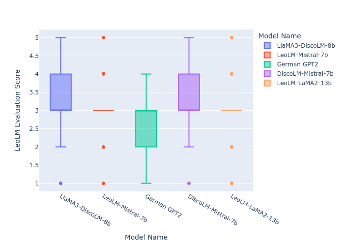
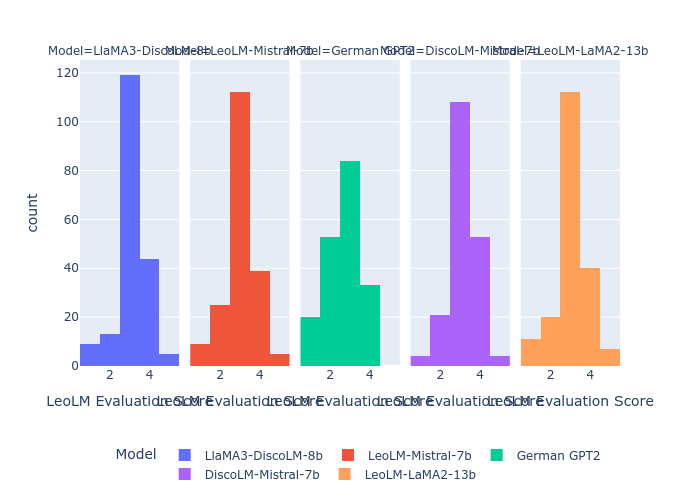
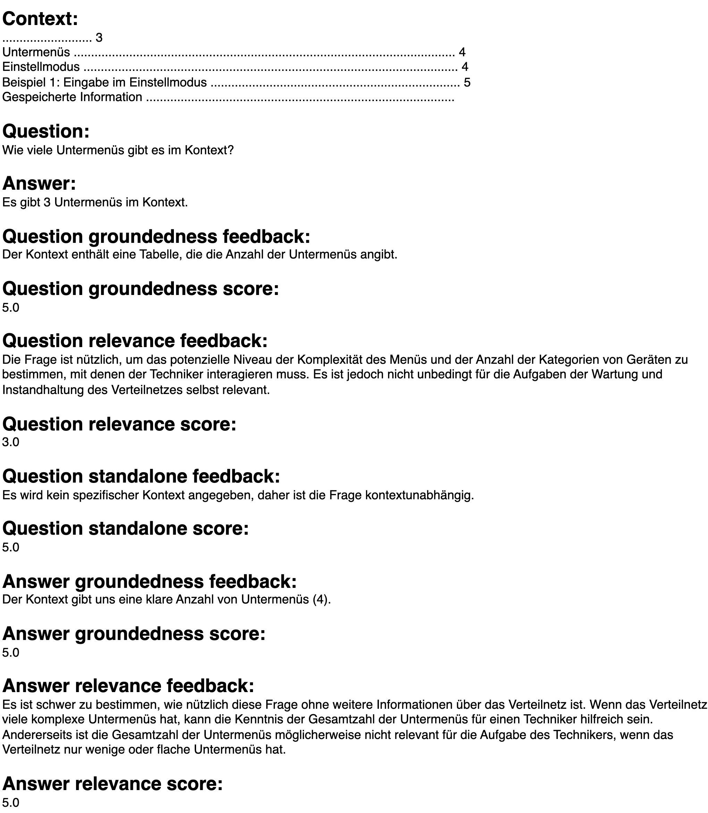
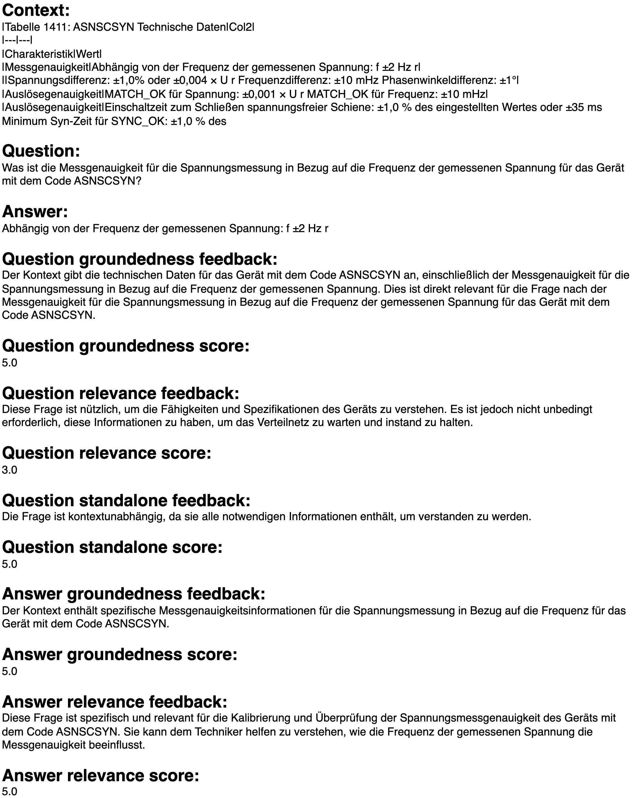

# Don't Touch the Power line

## Results of Open Source Evaluation using ABB data
| Models             |   Normalized Score |   Actual Score |
|:-------------------|-------------------:|---------------:|
| GPT2               |              0.421 |          2.684 |
| LeoLM-Mistral-7b   |              0.508 |          3.032 |
| LeoLM-LaMA2-13b    |              0.516 |          3.063 |
| LlaMA3-DiscoLM-8b  |              0.53  |          3.121 |
| DiscoLM-Mistral-7b |              0.542 |          3.168 |



The open source evaluation is shown in the image above. As we can see it supports the closed source paper results.



## Ongoing research: Some Limitations of automatic evaluation

Some contexts that are generated using the comparably small chunks of max 512 tokens (sometimes even smaller) are useless and the evaluation model is not able to correctly assess them.
In the image above, the context splitted by our method is taken from the agenda of the document. This is not relevant, while the model handles it as relevant. 
Additionally, it is not standalone, because the question refers directly to the context.
No technician in the maintenance would ask that. This will be adressed by incorporating better models in the ongoing work on this project.


As visible in the example above the evaluation can be biased or even false like the question relevance score given in the example.
The question of a given voltage frequency can be useful to detect errors while maintaining switch gears, but the model refers to it as unsure if its important for maintaining the distribution system.
Also this smaller bias in the evaluatuon will be adressed in future work with human evaluation of our research in progress.

## 1 Installation

Install using conda.

```
conda env create -f dtpl.yml
conda activate dtpl
```

## 2 Generate HuggingFace Token

Generate a your huggingface token (can be found [here](https://huggingface.co/docs/hub/en/security-tokens)).

## 3 Generate your datasets

Download all files from "data_generation/links.csv" to "data_generation/docs" (you may automate this process :blush:) then run
```
cd data_generation
python convert.py
```

## 4 Generate Questions and Answers
Run
```
cd ../
python 01_generate_qa.py
```
At the beginning you will be prompted to enter the huggingface access token.

## 5 Validate Questions and Answers
Run
```
python 02_validate_qa.py
```

## 6 Generate the RAG Answers of the 5 Models
Run
```
sh 03_generate_rag.sh
```

## 7 Generate the RAG Answers of the 5 Models
Run
```
sh 04_evaluate_rag.sh
```

## 8 Calculate Result Measures
Run all cells in _05_calculate_results.ipynb_.

## Other Information
If you have problems with running the scripts contact [sascha.kaltenpoth@uni-paderborn.de](mailto:sascha.kaltenpoth@uni-paderborn.de).
If you want to only get the measurements just start with the step 8.
